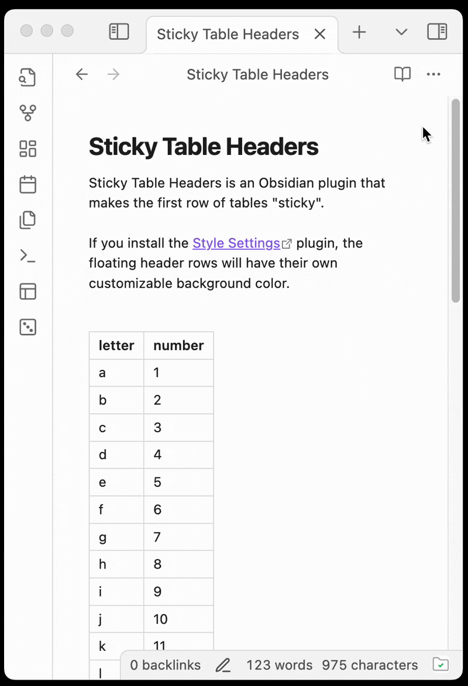

# Sticky Table Headers plugin for Obsidian

Sticky Table Headers is a plugin for [Obsidian](https://obsidian.md) that makes table headers sticky, so they stay visible when scrolling through long tables.

By default, the floating table headers are transparent and can be difficult to read.  If you install the [Style Settings](https://obsidian.md/plugins?id=obsidian-style-settings) plugin, floating table headers have a customizable background color.

This plugin works for me, but I do not use every corner of Obsidian, or many other plugins. If this plugin causes problems for you, please stop using it and let me know what happened.

## Installation

Sticky Table Headers has not yet been submitted to the Obsidian plugin gallery.

You can install this manually, but you could use the ["Beta Reviewer's Auto-update Tool" (BRAT)](https://tfthacker.com/BRAT) plugin.

## Usage

Once you install and enable the plugin, the first row of tables should be sticky.  If you have tabs open, you may need to reload them or switch between reading and editing view.

Installing the [Style Settings](https://obsidian.md/plugins?id=obsidian-style-settings) plugin enables backgrounds on floating table header. You can find the details by opening the Style Settings plugin settings and looking for "Sticky Table Headers".

## Technical Details

The IntersectionObserver in `main.ts` adds a `header-floating` class to tables when the header is floating.  This is used the styling found in `styles.css`.

Normally, Obsidian tables have `overflow-x: auto` set on a wrapper div.  This means that wide tables will have a scrollbar and scroll horizontally. However, I wasn't able to get the table headers to be sticky if there was a parent container with `overflow-x:` anything but `visible`.  This plugin overrides that, which may cause problems with wide tables.  Please let me know if you run into issues.

# Development

## Getting started

There are many ways to do this. If you don't already have a way you like, you can try this:
- 
- Clone this repository.
- Install the JavaScript dependencies with `npm install`.
- To compile `main.ts` into `main.js`, you can run `npm run dev`. This runs `watch mode`, where changes in the input files trigger a new build.

Obsidian won't automatically pick up changes in your files.

## Manually installing the plugin

- Copy over `main.js`, `styles.css`, `manifest.json` to your vault `VaultFolder/.obsidian/plugins/sticky-table-headers/`.
- Reload Obsidian, or toggle the plugin off and on again in Settings > Community plugins.

## Resources

* [Obsidian API Documentation](https://github.com/obsidianmd/obsidian-api)

## Releasing new releases

- Update your `manifest.json` with your new version number, such as `1.0.1`, and the minimum Obsidian version required for your latest release.
- Update your `versions.json` file with `"new-plugin-version": "minimum-obsidian-version"` so older versions of Obsidian can download an older version of your plugin that's compatible.
- Create new GitHub release using your new version number as the "Tag version". Use the exact version number, don't include a prefix `v`. See here for an example: https://github.com/obsidianmd/obsidian-sample-plugin/releases
- Upload the files `manifest.json`, `main.js`, `styles.css` as binary attachments. Note: The manifest.json file must be in two places, first the root path of your repository and also in the release.
- Publish the release.

> You can simplify the version bump process by running `npm version patch`, `npm version minor` or `npm version major` after updating `minAppVersion` manually in `manifest.json`.
> The command will bump version in `manifest.json` and `package.json`, and add the entry for the new version to `versions.json`

## License

sticky-table-headers is licensed under the GNU GPL v3.0 license.  Alternative licensing arrangements may be available upon request.

sticky-table-headers was started from a template at https://github.com/obsidianmd/obsidian-sample-plugin/commit/6d09ce3e39c4e48d756d83e7b51583676939a5a7.
